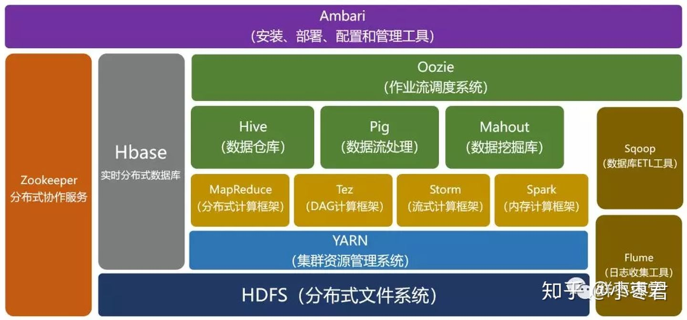

# 1. 初识Hadoop

## 1.1 数据！数据！
 - 说白了，比起十几年前的生活，我们现在的生活生产出多很多数据。
 - **“大数据胜于算法”**
   - (很牛的算法 + 基于少量数据) <（普通算法 + 基于大量数据）

## 1.2 数据的存储与分析

 - 比起从一个大的硬盘读取数据，**从多个小的硬盘读取数据比较快**；因为可以并行读取。
   - 在实际情况，可以将每个硬盘以**共享硬盘**的方式使用
   - 虽然这样比较有效率，但也引来了更多的问题：
    1. 硬件故障问题
       - 一旦开始使用多个硬件，其中个别硬件有可能发生故障的概率也很高
       - 为了避免数据丢失，最常见的做法是**复制（replication）**
         - 一旦系统发生故障，就可以使用另外保存的复本
         - RAID就是按照这个原理的
         - 但HDFS采取的方法就有点不同
    2. 大部分分析任务需要以某种方式**结合**大部分数据来**共同完成分析**
       - 如：从一个硬盘读的数据可能需要与另外99个硬盘读取的数据结合使用
       - **MapReduce**提出一个编程模型
         - 该模型抽象出这些硬盘读/写问题并将其转换为对一个数据集（由键-值对组成）的计算
         - 之后再解释这个

## 1.3 查询所有数据

 - MapReduce是一个**批量查询**处理器
   - 能够在合理的时间内处理针对整个数据集的查询
   - 这使得分析数据更加容易和快
   - 例如：Rackspace公司的部门Mailtrust就是用Hadoop帮助他们的工程师分析当中的数据

## 1.4 不仅仅是批处理

 - MapReduce是一个批处理系统，并不适合交互式分析（因为，一个查询需要几分钟以上）
 - 但现在，Hadoop经常被**用于形容一个生态系统**（不仅仅是HDFS和MapReduce了）
 - 经过时间的累积，Hadoop已经从最开始的两三个组件，发展成一个拥有20多个部件的生态系统。
 - The real enabler for new processing models in Hadoop was the introduction of **YARN** (which stands for Yet Another Resource Negotiator) in Hadoop 2. 
   - YARN is a **cluster resource management system**, which allows any distributed program (not just MapReduce) to run on data in a Hadoop cluster.

## 1.5 相较于其他系统的优势

 
### 1.5.1 关系性数据库 VS Hadoop
 - *Why can’t we use databases with lots of disks to do large-scale analysis?* 
 - *Why is Hadoop needed?*

 - Seeking（寻址）VS Transfer Rate（传输速度）
   - Seeking is the process of moving the disk’s head to a particular place on the disk to read or write data. It characterizes the latency of a disk operation。
   - Transfer rate corresponds to a disk’s bandwidth.
   - seek time is improving more slowly than transfer rate. 

 - Updating different proportion size in a db:
   - For updating a small proportion of records in a database, a traditional B- Tree (the data structure used in relational databases, which is limited by the rate at which it can perform seeks) works well. 
   - For updating the majority of a database, a B-Tree is less efficient than MapReduce, which uses Sort/Merge to rebuild the database.
 - Conclusion
   - In RDBMS is good for point queries or updates, where the dataset has been indexed to deliver low-latency retrieval and update times of a relatively small amount of data. -
   - MapReduce suits applications where the data is written once and read many times, whereas a relational database is good for datasets that Table 1-1. RDBMS compared to MapReduce are continually updated

 - b）关系型数据库的数据应该是结构化的，而Hadoop（MapReduce）主要是非结构化或者半结构化的。
   - Hadoop特别适合非结构化或者半结构化因为它是在处理数据时才对数据进行解释

 - c）扩展
   - 当数据规模非常大的时候，MapReduce可以通过增加节点的数量来减少时间消耗。因为MapReduce会将数据分块，主要的功能性基元Map和Reduce又是可以并行的。
   - 所以，根据数据规模线性扩展集群大小，就可以保证处理时间保持不变。

 - 总之：
   - 关系型数据库适合用于GB级以内的数据的高精度操作
   - MapReduce适合PB级及以上数据的低精度操作。
   - 且两者现在正互相学习各自长处来完善自己。
  

### 1.5.2 网络计算

 - 从广义上讲，**高性能计算**采用的方法就是将作业分散到集群的各台机器上，这些机器都访问一个共享文件系统。
   - 但如果节点需要访问的数据量更庞大，很多计算节点就会因为网络带宽的瓶颈问题而闲下来等数据
     - （因为手上的作业已经做完了，但访问的数据还没完成）
 - 相反，Hadoop尽量把计算节点上存储数据，以实现数据的本地快速访问。
   - 这是Hadoop数据处理的核心
   - 意思到网络带宽是数据中心最珍贵的资源之后

 - 在大规模分布式计算环境下，协调各个进程的执行是一个很大的挑战
   - 最苦难的是处理系统的部分失效问题（不知道一个远程进程是否挂了的情况下）同时还要继续完成整个计算
   - 有了MapReduce，程序员不必操心系统失效的问题，因为框架能够检测到失败的任务并重新在正常的机器上执行
   - 能做到这点是因为MapReduce采用了无共享（Shared-Nothing）框架，使得各个任务之间是彼此独立的

### 1.5.3 志愿计算

 - （SKIP）

