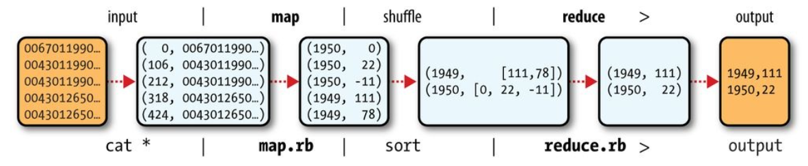
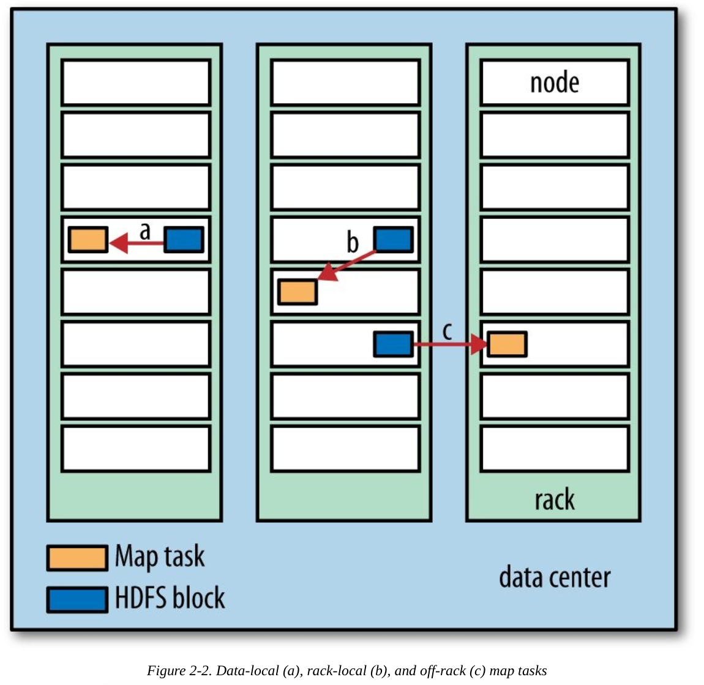
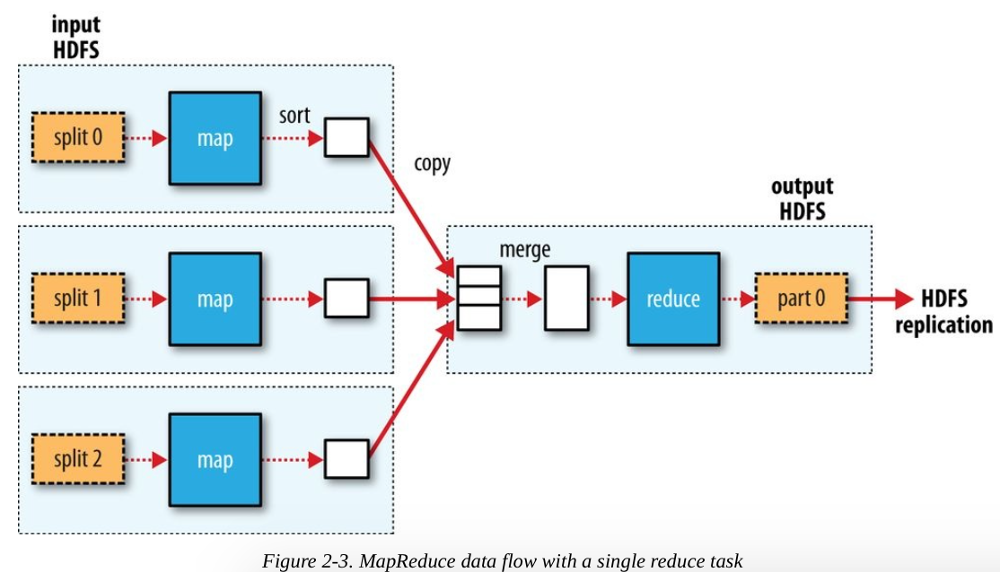
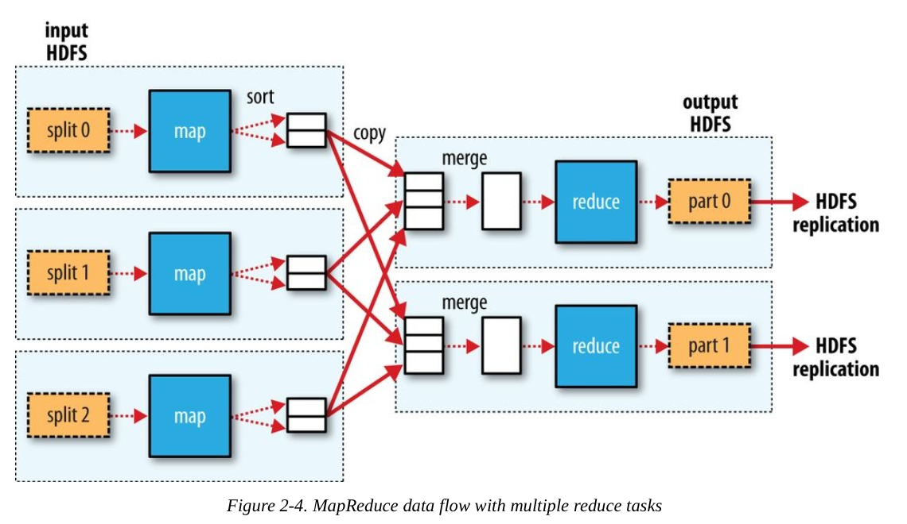
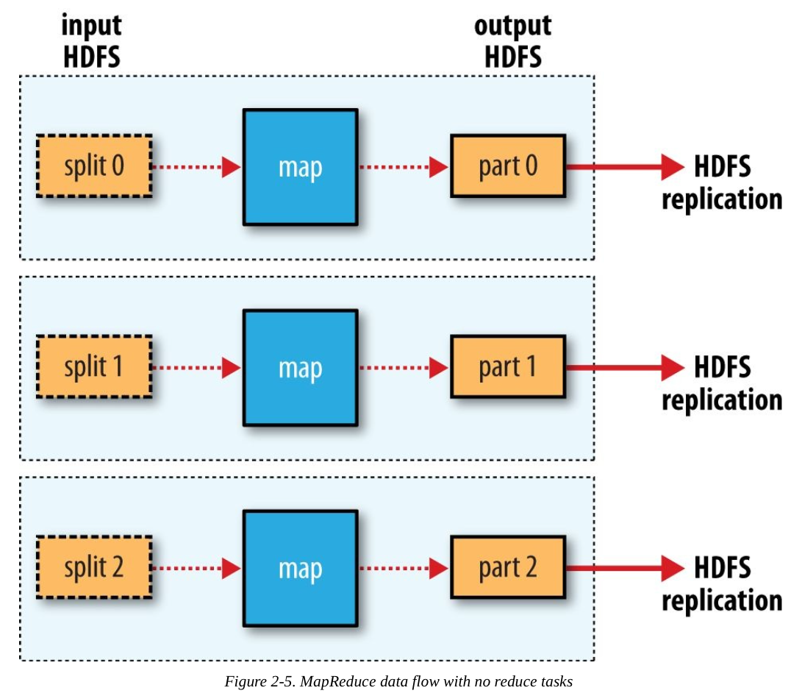

# 2 关于MapReduce

 - **MapReduce**是一种可用于**数据处理的编程模型**（programming model)
   - 该模型比较简单，但要想写出有用的程序却不容易
 - Hadoop可以**运行各种语言版本的MapReduce**
 - MapReduce本质上是**并行运行（Parallel Processing)**，因此可以将**大规模的数据**分析任务分给任何一个**拥有足够多机器的数据中心**。

## 2.1 气象数据集

 - 这里我们展示一个**例子**：一个分析大量气象数据的程序

## 2.2 使用Unix工具来分析数据

 - 每年全球气温的最高记录是多少？我们先**不使用Hadoop**解决这个问题
 - 以下的程序可以从记录中找出每年最高气温
```bash
#!/usr/bin/env bash
for year in all/* do
echo -ne `basename $year .gz`"\t" gunzip -c $year | \
    awk '{ temp = substr($0, 88, 5) + 0;
           q = substr($0, 93, 1);
if (temp !=9999 && q ~ /[01459]/ && temp > max) max = temp } END { print max }'
done
```

 - 这个脚本循环遍历按年压缩的所有数据文件
   - 从每个数据文件中取出年份和气温，检查数据是否正确，然后拿该值将目前读取的最高气温进行比较。如果该值比原先的大，就替换目前的最高气温值。
 - 使用一个亚马逊的EC2 High-CPU Extra Large Instance运行这个程序，需要**42分钟**。
   - 一个10节点同样instance执行**MapReduce版本只需要6分钟**！
 
**有进步空间？**

1. 使用计算机的所有可用的**硬件线程（hardware threads）**并行处理；每个线程负责不同的年份
   - 但这个方法有问题：**不同年份的数据有不同的大小**
     - 因此，一部分的线程会比其他线程更早结束运行。
     - 最后**总运行时间仍然取决于处理最长文件所需要的时间**
     - 所以一定要把**任务划分成大小相同**

2. 因此，可以将输入**数据分成固定大小的块（chunks）**，然后每块分到各个进程进行
   - 此外，还需要一个**合并**各个独立进程的结果的步骤

3. 使用**多台计算机**
 - 但这个做法引来了**协调性和可靠性的问题**。
   - 哪个进程负责运行整个作业？
   - 我们如何处理失败的进程？

 - 因此，虽然这是可行，实际上却很麻烦；我们可以借助于Hadoop类似的架构解决这个问题

## 2.3 使用Hadoop来分析数据

 - 首先，我们需要将查询表示成MapReduce作业。

### 2.3.1 Map and Reduce

 - MapReduce任务过程分为两个处理阶段：**map和reduce**
   - 每个阶段都以**键-值对作为输入和输出**
   - 程序员还需要写两个函数：map函数和reduce函数
  
 - Map阶段的输入是原始数据
   - Map函数很简单：遍历每行数据，如数据正确，取出年份和气温（如数据不正确或缺失，忽略它）
   - Map函数只是一个数据准备阶段，使Reduce函数能够对他进行处理

 - **Map**函数的输出经由MapReduce框架处理，当中**基于键来对键-值对进行排序和分组**
```
# Before
(1950, 0)
(1950, 22)
(1950, -11)
(1951, 4)
(1951, 12)
(1952, 2)

# After Sorting + Grouping

(1950, [0, 22, -11])
(1951, [4, 12])
(1952, [2])
```

 - **Reduce**函数只需要遍历整个列表并**从中找最大的气温**
```
# Reduce Output
(1950, 22)
(1951, 12)
(1952, 2)
```



## 2.3.2 Java MapReduce

 - Map函数是由Mapper类表示的：

```java
// Mapper
import java.io.IOException;
import org.apache.hadoop.io.IntWritable; 
import org.apache.hadoop.io.LongWritable; 
import org.apache.hadoop.io.Text;
import org.apache.hadoop.mapreduce.Mapper;

public class MaxTemperatureMapper extends Mapper<LongWritable, Text, Text, IntWritable> {
  private static final int MISSING = 9999;

  @Override
  public void map(LongWritable key, Text value, Context context) throws IOException, InterruptedException {
    String line = value.toString();
    String year = line.substring(15, 19);
    int airTemperature;

    if (line.charAt(87) == '+') { // parseInt doesn't like leading plus signs
      airTemperature = Integer.parseInt(line.substring(88, 92)); 
    } else {
      airTemperature = Integer.parseInt(line.substring(87, 92)); 
    }
    
    String quality = line.substring(92, 93);
    if (airTemperature != MISSING && quality.matches("[01459]")) {
      context.write(new Text(year), new IntWritable(airTemperature)); 
    }
  }
}
```
 - 解释：
   - Hadoop本身提供了**一套可优化网络序列化传输的基本类型**（在org.apache.hadoop.io package)；即org.apache.hadoop.io的`IntWritable`, `LongWritable`和`Text`
   - Map函数的**输入是键值和Context**
     - **Context**实例用于**输出内容的写入**

 - Reduce函数用Reducer类来定义：

```java
// Reducer

import java.io.IOException;
import org.apache.hadoop.io.IntWritable; 
import org.apache.hadoop.io.Text;
import org.apache.hadoop.mapreduce.Reducer;

public class MaxTemperatureReducer extends Reducer<Text, IntWritable, Text, IntWritable> {
  @Override
  public void reduce(Text key, Iterable<IntWritable> values, Context context) throws IOException, InterruptedException {
    int maxValue = Integer.MIN_VALUE; 

    for (IntWritable value : values) {
      maxValue = Math.max(maxValue, value.get()); 
    }

    context.write(key, new IntWritable(maxValue)); 
  }
}
```
 - 解释：
   - reduce函数的输入类型必须匹配map函数的输出

 - 第三部分代码负责运行MapReduce作业：

```java
import org.apache.hadoop.fs.Path;
import org.apache.hadoop.io.IntWritable;
import org.apache.hadoop.io.Text;
import org.apache.hadoop.mapreduce.Job;
import org.apache.hadoop.mapreduce.lib.input.FileInputFormat; 
import org.apache.hadoop.mapreduce.lib.output.FileOutputFormat;

public class MaxTemperature {
  public static void main(String[] args) throws Exception {
    if (args.length != 2) {
      System.err.println("Usage: MaxTemperature <input path> <output path>");
      System.exit(-1); 
    }
    
    Job job = new Job(); 

    job.setJarByClass(MaxTemperature.class); 
    job.setJobName("Max temperature");

    FileInputFormat.addInputPath(job, new Path(args[0])); FileOutputFormat.setOutputPath(job, new Path(args[1]));

    job.setMapperClass(MaxTemperatureMapper.class); 
    job.setReducerClass(MaxTemperatureReducer.class);

    job.setOutputKeyClass(Text.class);
    job.setOutputValueClass(IntWritable.class);

    System.exit(job.waitForCompletion(true) ? 0 : 1); 
  }
}
```

 - 解释：
   - **Job对象**指定**作业执行规范**
     - 我们可以用它来控制作业的运行
   - 我们在Hadoop集群上运行这个作业时，要把代码打包成JAR文件（Hadoop会在集群上发布这个文件）
     - 此时，我们不用明确JAR文件的名称，在Job对象的`setJarByClass`方法中传递一个类即可
       - Hadoop会利用这个类来查找包含它的JAR文件
   - 构造Job对象后，需要**指定输入和输出的路径**
     - 使用`FileInputFormat`的`addInputPath()`来定义输入数据的路径
       - 这个路径可以是单个的文件，目录或file pattern
       - 可多次调用该函数来实现多路径的输入
     - 使用`FileInputFormat`的`addOutputPath()`来定义输出数据的路径
       - 在运行作业之前该目录不应该存在，否者Hadoop会报错并拒绝运行作业
         - 这种预防措施的目的是防止数据丢失（长时间运行的作业如果意外覆盖是个很头痛的事）
   - 接着，通过`setMapperClass`和`setReducerClass`方法**定义map类型和reduce类型**
   -  `setOutputKeyClass`和`setOutputValueClass`方法**控制reduce函数的输出**。
     - map函数的输出在默认情况下和reduce函数的输出是相同的，因此如果是这样的话就不需要定义
       - 但如果不同（map的输出 =/= reduce的输出），则必须通过`setMapOutputKeyClass()`和`setMapOutputValueClass()`定义map的输出类型
   - 设置map和reduce函数之后，可以**开始**运行作业。
     - `waitForCompletion()`函数**提交作业并等待执行完成**
       - 参数指示是否生成详细输出(verbose output)
       - waitForCompletion返回一个布尔值，表示执行成功（true）或失败（false），这个布尔值被转换成程序的退出代码0或者1。

#### 2.3.2.1 运行测试

 - 写好MapReduce之后，通常要拿一个**小型数据集**进行**测试**以排除代码问题
 - 首先，以独立模式安装Hadoop

```
% export HADOOP_CLASSPATH=hadoop-examples.jar
% hadoop MaxTemperature input/ncdc/sample.txt output
....
```

 - 如果调用hadoop命令的第一个参数是类名，Hadoop就会启动一个JVM运行这个类
 - 该Hadoop命令将Hadoop库(Hadoop Libraries and dependencies)添加到类路径中，同时也能获得Hadoop配置信息（？？）
 - 为了将应用类添加到类路径中，我们定义了一个HADOOP_CLASSPATH环境变量，然后由Hadoop脚本来执行相关操作
 - 可以从运行作业所得到的输出获取一些有用的信息
   - 如：作业ID和任务ID（这个都非常有用）

## 2.4 横向扩展

 - 为了横向扩展（scaling out），我们需要把数据存储在分布式文件系统中（HDFS）
 - 通过使用Hadoop资源管理系统YARN,Hadoop可以将MapReduce计算转移到存储有部分数据的各台机器上

### 2.4.1 数据流

 - **MapReduce作业（job）**是**客户端**需要执行的一个**工作单元**
   - 它包括输入数据，MapReduce程序和配置信息
 - Hadoop将**作业分成若干个任务（task）**，其中包括两种任务：map任务和reduce任务
   - 任务通过**YARN进行调度**(schedule)并运行在集群的节点上
   - 如果一个任务**失败**，他将被**重新调度**到不同的节点上运行
   - Hadoop将MapReduce的输入数据划分成等长的小数据块，称为**输入分片（input split）或“分片”**。
   - Hadoop为**每个分片构建一个map任务**，并使用该map任务处理分片中的每一条数据
     - 拥有很多分片，意味着处理每个分片的时间比处理整个输入的时间小很多。
       - (这句的中文怪怪的：Having many splits means the time taken to process each split is small compared to the time to process the whole input. )
     - 因此，如果我们**并行处理每个分片**，整个处理过程将获得**更好的负载平衡**，因为较快的计算机能够比较慢的计算机处理更多的数据分片。
     - 即使所有计算机都相同，并行运行的失败进程或作业使得更好的负载平衡

 - 另一方面，**如果分片太小**，**管理分片和构造map任务的总时间会占更多的总执行时间**
   - 对于大多数jobs，一个**合理的分片**大小趋向于一个**HDFS块的大小**，默认是128mb。

 - 为了**尽少使用宝贵的集群带宽资源**，Hadoop会尽量在拥有对应输入数据的节点上运行对应的map任务；这就是所谓的“**数据本地化优化(data locality optimization)**”
   - 但是，有时对于一个map任务的输入分片来说，**存储该分片的HDFS数据块副本（block replicas)**的所有节点都**忙着**运行其他map任务
   - 此时，**作业调度(job scheduler)**需要从其中**一个HDFS数据块副本的机架（rack）中寻找**一个空闲的**map槽（slot）**来运行该map任务分片
     - 有时候，如果连这个可能性都没有（基本上不会发生），那就只好使用机架与机架之间的网络传输
 - 以下图片展示了这**三个可能性**



 - 现在应该清楚**为什么一个合理的分片大小是一个HDFS块的大小**：
   - 因为一个**map函数最大的输入就是一个HDFS块的大小**
   - 如果分片跨域两个数据块，那么任何一个HDFS节点，基本不可能存储两个数据块，因此需要透过网络传输执行map函数所需要需要的数据块部分
     - 这种方法显然效率低

 - **Map任务其输出写到本地硬盘**，而非HDFS
   - 为什么？因为Map输出是**中间结果**：该中间结果由reduce任务处理后才产生最终结果，而且一旦完成，map的输出就可以删除
   - 因此，把map的输出存储在HDFS并实现备份，难免有些小题大做
   - 如果执行某个map任务的节点在将map的中间结果传输给reduce任务之前失败，Hadoop将在另一个节点重新执行该map任务

 - **reduce的输出**通常存储在**HDFS**中以实现**可靠**存储。
   - 对于每个HDFS块的reduce输出，第一个复本存储在本地节点，其他复本出于可靠性存储在其他机架的节点中
   - 因此，写reduce输出会消耗带宽，但这与正常的HDFS管线写入的消耗一样

 - **一个reduce任务**的数据流如以下的图
   - 虚线框 = 节点
   - 虚线箭头 = 节点内部的数据传输
   - 实线箭头 = 节点之间的数据传输



 - **reduce任务的数量不是由输入数据大小决定**，而是独立定义的
 - 如果有**多个reduce任务**，每个**map任务**就会针对输出进行**分区（partition）**，即为每个reduce任务建一个分区。
   - 每个分许有许多键，但每个键对应的键值对都在同一个分区中
 - **分区可由一个自定义函数控制**，但通常使用哈希函数分区的默认partitioner就已经足够

 - **多个reduce任务**的数据流如以下图



 - **map**任务和**reduce**任务之间的**数据传输**称为**shuffle（混洗）**
   - 一般的shuffle比以上的图更复杂
  
 - 最后，当处理过程可以完全并行执行，可能会出现**没有reduce任务的情况**



### 2.4.1 combiner函数

 - 很多MapReduce作业都被集群中的带宽限制，因此**尽量避免map任务和reduce任务之间的数据传输**是有利的
   - Hadoop允许用户针**对map输出定义一个combiner函数**，combiner函数的输出作为reduce任务的输入
   - 由于combiner是**一种优化**，Hadoop不保证对一个map输出调用combiner函数的次数
     - 换而言之，不管调用combiner函数多少次（0次、1次或多次），reducer的输出结果都是一样的

**例子 1（最简单）**
 - 假设1950年的气温由两个map任务进行处理，在假设第一个map的输出是：
```
(1950, 0)
(1950, 20)
(1950, 10)
```
 - 而第二个map的输出是：
```
(1950, 15)
(1950, 25)
```
 - 因此reduce任务的输入就是 `(1950, [0, 20, 10, 15, 25])`，reduce的输出是`(1950, 25)`

**例子 2（使用combiner）**
 - 如果我们使用combiner函数，reduce任务的输入可以变成`(1950, [20, 25])`，reduce的输出也跟之前相同
   - 用数学表达`max(max(0, 20, 10), max(15, 25)) = max(20, 25) = 25`

**combiner函数不能取代reducer任务**
 - 注意的是combiner函数不能取代reducer任务，combiner函数**的目的是减少map任务和reduce任务之间的数据传输**；因此，常常推荐使用combiner函数

**指定一个combiner**
 - 回到之前的MapReduce程序，combiner函数是通过reduce类来定义的

```java
job.setCombinerClass(MaxTemperatureReducer.class);
job.setReducerClass(MaxTemperatureReducer.class);
```

### 2.4.3 执行分布式的MapReduce作业

 - MapReduce的优势是他会**按照你输入大小及硬件性能扩展**
 - 在刚刚的例子，一个10节点EC2集群运行High-CPU Extra Large Instance，程序时间花了**6分钟**。

## 2.5 Hadoop Streaming

 - Hadoop提供的MapReduce API允许你**使用非Java**（其他语言）来**写自己的map和reduce函数**
   - Hadoop Streaming使用了**unix标准流**作为**Hadoop和应用程序之间的接口**。
     - 因此在编写MapReduce程序时，你可以使用任何编程语言来读取输入和写输出
 - Streaming天生**适合用于文本处理**
   - **Map输入**数据通过**标准输入流传给map函数**，并且一行一行地处理，最后将**结果行写到标准输出**
   - Map输出和Reduce的输入的键值对以一个**制表符号分割的行（single tab-delimited line)输出**

### 2.5.1 Ruby例子

 - 以下是Ruby版本的Map函数
```ruby
# Example 2-7. Map function for maximum temperature in Ruby
#!/usr/bin/env ruby
STDIN.each_line do |line|
  val = line
  year, temp, q = val[15,4], val[87,5], val[92,1]
  puts "#{year}\t#{temp}" if (temp != "+9999" && q =~ /[01459]/)
end
```

 - 由于这个脚本只在标准输入和标准输出上运行，所以**最简单的测试方法是通过unix管桐（unix pipe)**，而不使用Hadoop

```
% cat input/ncdc/sample.txt | ch02-mr-intro/src/main/ruby/max_temperature_map.rb 1950 +0000
1950  +0022
1950  -0011
1949  +0111
1949  +0078
```

 - 以下是Ruby版本的Reduce函数

```ruby
# Example 2-8. Reduce function for maximum temperature in Ruby
#!/usr/bin/env ruby
last_key, max_val = nil, -1000000 
STDIN.each_line do |line|
  key, val = line.split("\t")
  if last_key && last_key != key      # meet a different key
    puts "#{last_key}\t#{max_val}"    # output last_key data
    last_key, max_val = key, val.to_i # update last_key with (new)key

  else                                # meet same key as last_key
    last_key, max_val = key, [max_val, val.to_i].max  # find max between max_val and (new)val
  end
end
puts "#{last_key}\t#{max_val}" if last_key  # print out last_key info
```

 - MapReduce框架保证键的有序性，我们由此可知，如果读到一个键与前一个键不同，就需要开始处理一个新的键。

 - 同上，我们可以通过unix管线模拟整个MapReduce管线(pipeline)
```
% cat input/ncdc/sample.txt | \ ch02-mr-intro/src/main/ruby/max_temperature_map.rb | \
sort | ch02-mr-intro/src/main/ruby/max_temperature_reduce.rb
1949 111
1950 22
```

 - **Hadoop命令不支持Streaming**，因此，**定义jar时必须加入Streaming JAR文件**
   - Streaming程序的选项指定了输入路径、输出路径、map脚本和reduce脚本
   - 如下所示：
  
```
% hadoop jar $HADOOP_HOME/share/hadoop/tools/lib/hadoop-streaming-*.jar \ -input input/ncdc/sample.txt \
-output output \
-mapper ch02-mr-intro/src/main/ruby/max_temperature_map.rb \
-reducer ch02-mr-intro/src/main/ruby/max_temperature_reduce.rb
```

 - 当在一个集群运行一个大的数据集，应该使用`-combiner`选项来**定义combiner**：

```
% hadoop jar $HADOOP_HOME/share/hadoop/tools/lib/hadoop-streaming-*.jar \ -files ch02-mr-intro/src/main/ruby/max_temperature_map.rb,\
ch02-mr-intro/src/main/ruby/max_temperature_reduce.rb \
-input input/ncdc/all \
-output output \
-mapper ch02-mr-intro/src/main/ruby/max_temperature_map.rb \ -combiner ch02-mr-intro/src/main/ruby/max_temperature_reduce.rb \ -reducer ch02-mr-intro/src/main/ruby/max_temperature_reduce.rb
```

### 2.5.2 Python脚本

(SKIP)
